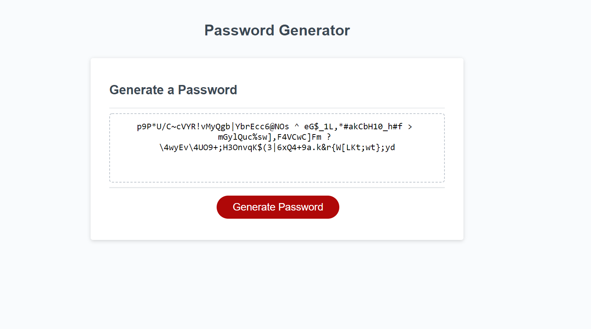

## 03 JavaScript: Password Generator

# Objective:
    *Create script that randomly generates password based on user selection criteria\

# Project Criteria 
    *Promted user to length of password which must be between 8 - 128 characters\
    *Allowed user to specify if lower case, upper case, numeric, and/or special characters would be in password\
    *Specifies at least one character above must be utilized\
    *Password is generated based on user inputs and written into textbox on screen

# Built With:
    *Javascript\
    *HTML (provided)\
    *CSS (provided)

# Links
💀 [Deployed Website](https://rpb543.github.io/password-generator/)
👻 [Repo](https://github.com/RPB543/password-generator)
☠️ [Github](https://github.com/RPB543)

# Screenshot

